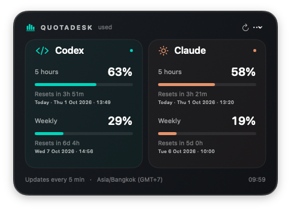
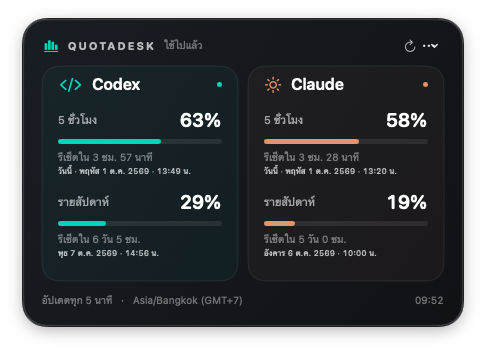
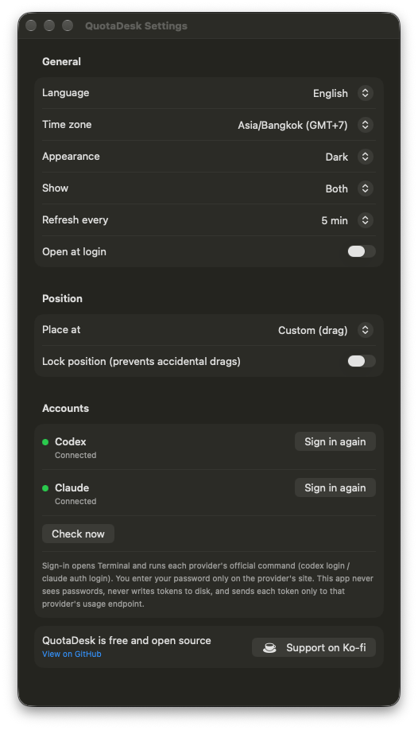
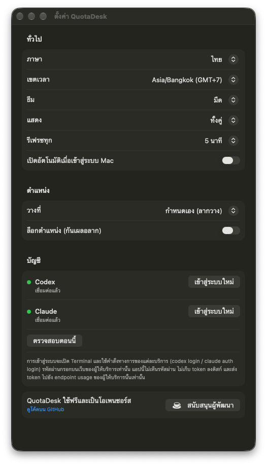

<div align="center">

# QuotaDesk

**See your Codex and Claude subscription quota at a glance, right on your Mac desktop.**<br>
**ดูโควตา Codex และ Claude ที่ใช้ไปได้ในพริบตา บนเดสก์ท็อป Mac ของคุณ**


[](https://ko-fi.com/filmpaisan)

[English](#english) · [ภาษาไทย](#ภาษาไทย)

<table>
  <tr>
    <td align="center"></td>
    <td align="center"></td>
  </tr>
  <tr>
    <td align="center"><sub>English</sub></td>
    <td align="center"><sub>ภาษาไทย</sub></td>
  </tr>
</table>

**Install in one command · ติดตั้งด้วยคำสั่งเดียว**

</div>

```sh
curl -fsSL https://raw.githubusercontent.com/filmpaisan/QuotaDesk/main/install.sh | zsh
```

---

## English

### Features

- **Both providers side by side:** Codex (ChatGPT) and Claude, showing the 5-hour and weekly windows
- **Exact reset times:** a countdown plus the date and time, e.g. `Today · Thu 1 Oct 2026 · 13:49`
- **Your time zone:** follow the Mac, or pick any zone
- **English or Thai UI:** Thai uses Buddhist-era dates
- **Light, dark or auto theme:** auto follows macOS
- **Show both, Codex only or Claude only:** a hidden provider is never contacted
- **Adjustable refresh:** 1–60 minutes, 5 by default to stay clear of rate limits
- **One-click sign-in:** uses each provider's official CLI, so the app never sees your password
- **Place it anywhere:** drag it, or snap it to any corner of any display, then lock it in place. It stays behind your windows or floats on top, and can open at login

### Requirements

- macOS 14 or later
- The Xcode Command Line Tools (the installer offers to install them if they're missing)
- A Codex and/or Claude **subscription** (API keys aren't supported)
- The official CLIs: [Codex CLI](https://github.com/openai/codex) and [Claude Code](https://docs.anthropic.com/en/docs/claude-code/setup)

### Install

Paste this into Terminal:

```sh
curl -fsSL https://raw.githubusercontent.com/filmpaisan/QuotaDesk/main/install.sh | zsh
```

The script downloads the latest source, builds it on your Mac (about 10 seconds), installs it to `~/Applications/QuotaDesk.app` and starts it. It doesn't need `sudo`. Because the app is built locally, Gatekeeper doesn't block it. If the Xcode Command Line Tools are missing, the script opens their installer; run the command again once that finishes.

| | |
|---|---|
| **Update** | Run the same command again |
| **From a clone** | `git clone https://github.com/filmpaisan/QuotaDesk.git && cd QuotaDesk && ./install.sh` |
| **Uninstall** | `curl -fsSL https://raw.githubusercontent.com/filmpaisan/QuotaDesk/main/install.sh \| zsh -s -- --uninstall` |
| **Custom bundle ID** | `BUNDLE_ID=com.yourname.quotadesk zsh build.sh` |

### Usage



1. Open **Settings & accounts…** from the `⋯` menu on the widget or the menu-bar icon (⌘,).
2. Under **Accounts**, click **Sign in** for each provider. Terminal opens and runs `codex login` or `claude auth login`. Finish the steps in your browser, and the widget updates within a few seconds.
3. Pick your **language**, **theme**, **time zone**, which providers to **show**, how often to **refresh** and where to **place** the widget.

- Drag the widget's background to move it, or pick a corner under `⋯` → **Position** (or in Settings, where you can also choose the display).
- `⋯` → **Lock position** stops accidental drags.
- `⋯` → **Float above windows** keeps it on top.
- Percentages show quota **used**. A bar turns red at 90%.

<br clear="right">

### Privacy and security

- **No passwords.** Sign-in happens on the provider's own website through its official CLI.
- **Uses existing credentials only:** the app reads what the CLIs already saved, `~/.codex/auth.json` (or `$CODEX_HOME`) and Claude Code's `~/.claude/.credentials.json` or its `Claude Code-credentials` Keychain item. The Keychain item is read through `/usr/bin/security`, so there are no repeated password prompts.
- **Tokens stay put.** Each token is sent only to its own provider's HTTPS usage endpoint. It's never written to disk, logged or copied elsewhere, and the app never refreshes or rewrites the CLIs' tokens.
- **No secrets in settings:** language, theme, time zone, refresh interval, shown providers and placement are stored in standard UserDefaults.
- **Rate-limit friendly:** an HTTP 429 pauses only that provider, following `Retry-After`.

### Diagnostics

```sh
~/Applications/QuotaDesk.app/Contents/MacOS/QuotaDesk --self-test   # offline unit checks
~/Applications/QuotaDesk.app/Contents/MacOS/QuotaDesk --check       # live read, prints percentages only
```

> [!NOTE]
> Prefer the install command over sharing a prebuilt `.app`. A downloaded `.app` is only ad-hoc signed, so the recipient has to right-click → **Open** the first time.

---

## ภาษาไทย

### ความสามารถ

- **ดูได้ทั้งสองบริการในที่เดียว:** Codex (ChatGPT) และ Claude แสดงทั้งรอบ 5 ชั่วโมงและรอบรายสัปดาห์
- **บอกเวลารีเซ็ตชัดเจน:** มีทั้งนับถอยหลังและวันเวลาจริง เช่น `วันนี้ · พฤหัส 1 ต.ค. 2569 · 13:49 น.`
- **เลือกเขตเวลาได้:** ตามเครื่อง หรือเลือกเขตใดก็ได้
- **ภาษาไทยหรืออังกฤษ:** ภาษาไทยแสดงปีเป็น พ.ศ.
- **ธีมสว่าง มืด หรืออัตโนมัติ:** แบบอัตโนมัติเปลี่ยนตาม macOS
- **เลือกได้ว่าจะแสดงทั้งคู่, เฉพาะ Codex หรือเฉพาะ Claude:** ฝั่งที่ซ่อนจะไม่ถูกเรียกใช้งานเลย
- **ตั้งความถี่รีเฟรชได้:** 1–60 นาที ค่าเริ่มต้น 5 นาทีเพื่อไม่ให้ติด rate limit
- **เข้าสู่ระบบได้ในคลิกเดียว:** ผ่าน CLI ทางการของแต่ละบริการ แอปไม่เห็นรหัสผ่านของคุณ
- **วางตรงไหนก็ได้:** ลากเอง หรือให้ชิดมุมใดก็ได้ของจอไหนก็ได้ แล้วล็อกตำแหน่งไว้ อยู่หลังหน้าต่างอื่นหรือลอยอยู่ด้านบนก็ได้ และเปิดอัตโนมัติเมื่อเข้าเครื่องได้

### สิ่งที่ต้องมี

- macOS 14 ขึ้นไป
- Xcode Command Line Tools (ถ้ายังไม่มี ตัวติดตั้งจะเปิดหน้าติดตั้งให้)
- **บัญชีสมาชิก** Codex และ/หรือ Claude (ใช้ API key ไม่ได้)
- CLI ทางการ: [Codex CLI](https://github.com/openai/codex) และ [Claude Code](https://docs.anthropic.com/en/docs/claude-code/setup)

### ติดตั้ง

วางคำสั่งนี้ใน Terminal:

```sh
curl -fsSL https://raw.githubusercontent.com/filmpaisan/QuotaDesk/main/install.sh | zsh
```

สคริปต์จะดาวน์โหลด source ล่าสุด build บนเครื่องคุณ (ประมาณ 10 วินาที) ติดตั้งที่ `~/Applications/QuotaDesk.app` แล้วเปิดแอปให้ ไม่ต้องใช้ `sudo` และเพราะ build บนเครื่องเอง macOS จึงไม่บล็อกแอป ถ้ายังไม่มี Xcode Command Line Tools สคริปต์จะเปิดตัวติดตั้งให้ ติดตั้งเสร็จแล้วรันคำสั่งเดิมอีกครั้ง

| | |
|---|---|
| **อัปเดต** | รันคำสั่งเดิมอีกครั้ง |
| **ติดตั้งจากโฟลเดอร์ที่โคลนไว้** | `git clone https://github.com/filmpaisan/QuotaDesk.git && cd QuotaDesk && ./install.sh` |
| **ถอนการติดตั้ง** | `curl -fsSL https://raw.githubusercontent.com/filmpaisan/QuotaDesk/main/install.sh \| zsh -s -- --uninstall` |
| **ใช้ bundle ID ของตัวเอง** | `BUNDLE_ID=com.yourname.quotadesk zsh build.sh` |

### วิธีใช้



1. เปิด **ตั้งค่าและบัญชี…** จากเมนู `⋯` บนวิดเจ็ต หรือไอคอนบนแถบเมนู (⌘,)
2. ในส่วน **บัญชี** กด **เข้าสู่ระบบ** ของแต่ละบริการ แอปจะเปิด Terminal และรัน `codex login` หรือ `claude auth login` ให้ ทำขั้นตอนในเบราว์เซอร์ให้เสร็จ แล้ววิดเจ็ตจะอัปเดตเองภายในไม่กี่วินาที
3. เลือก **ภาษา**, **ธีม**, **เขตเวลา**, บริการที่จะ **แสดง**, ความถี่ในการ **รีเฟรช** และ **ตำแหน่ง** ของวิดเจ็ต

- ลากพื้นหลังวิดเจ็ตเพื่อย้ายตำแหน่ง หรือเลือกมุมที่ `⋯` → **ตำแหน่ง** (หรือในหน้าตั้งค่า ซึ่งเลือกจอได้ด้วย)
- `⋯` → **ล็อกตำแหน่ง** กันเผลอลาก
- `⋯` → **ลอยเหนือหน้าต่างอื่น** เพื่อให้วิดเจ็ตอยู่ด้านบนตลอด
- เปอร์เซ็นต์คือโควตาที่ **ใช้ไปแล้ว** แถบจะเป็นสีแดงเมื่อถึง 90%

<br clear="right">

### ความเป็นส่วนตัวและความปลอดภัย

- **ไม่ต้องให้รหัสผ่านกับแอป:** การเข้าสู่ระบบทำบนเว็บของผู้ให้บริการเอง ผ่าน CLI ทางการ
- **ใช้ข้อมูลล็อกอินที่ CLI บันทึกไว้แล้วเท่านั้น:** คือ `~/.codex/auth.json` (หรือ `$CODEX_HOME`) และ `~/.claude/.credentials.json` หรือรายการ `Claude Code-credentials` ใน Keychain รายการใน Keychain อ่านผ่าน `/usr/bin/security` จึงไม่มีหน้าต่างถามรหัสซ้ำๆ
- **token ไม่ถูกส่งไปที่อื่น:** แต่ละ token ส่งไปที่ endpoint usage แบบ HTTPS ของผู้ให้บริการนั้นเท่านั้น ไม่บันทึกลงดิสก์ ไม่เขียนลง log และไม่คัดลอกไปที่ใด แอปไม่ต่ออายุหรือแก้ไข token ของ CLI
- **การตั้งค่าไม่มีข้อมูลลับ:** ภาษา, ธีม, เขตเวลา, ความถี่รีเฟรช, บริการที่แสดง และตำแหน่ง เก็บใน UserDefaults ปกติ
- **เคารพ rate limit:** ถ้าเจอ HTTP 429 แอปจะพักเฉพาะบริการนั้น ตาม `Retry-After`

### ตรวจสอบการทำงาน

```sh
~/Applications/QuotaDesk.app/Contents/MacOS/QuotaDesk --self-test   # ทดสอบแบบไม่ต่อเน็ต
~/Applications/QuotaDesk.app/Contents/MacOS/QuotaDesk --check       # อ่านค่าจริง แสดงแค่เปอร์เซ็นต์
```

> [!NOTE]
> แนะนำให้ใช้คำสั่งติดตั้งแทนการแจกไฟล์ `.app` ที่ build แล้ว ไฟล์ `.app` ที่ดาวน์โหลดไปลงนามแบบ ad-hoc เท่านั้น ผู้รับต้องคลิกขวา → **Open** ในครั้งแรก

---

## Support · สนับสนุน

QuotaDesk is free and always will be. If it saves you a trip to the usage page, you can buy me a coffee. Thank you! 🙏

QuotaDesk ใช้ฟรีตลอดไป ถ้ามีประโยชน์กับคุณ เลี้ยงกาแฟผู้พัฒนาได้ที่ลิงก์ด้านล่าง ขอบคุณครับ 🙏

<a href="https://ko-fi.com/filmpaisan"></a>

Bug reports and ideas are welcome too: [open an issue](https://github.com/filmpaisan/QuotaDesk/issues). · แจ้งบั๊กหรือเสนอไอเดียได้ที่ [Issues](https://github.com/filmpaisan/QuotaDesk/issues)

## Disclaimer · ข้อสงวนสิทธิ์

QuotaDesk is an independent, unofficial project. It is not affiliated with, endorsed by or sponsored by OpenAI or Anthropic. "Codex", "ChatGPT" and "Claude" are trademarks of their respective owners and are used only to describe compatibility. The usage endpoints it reads are undocumented and may change or stop working at any time. Use at your own risk.

QuotaDesk เป็นโปรเจกต์อิสระ ไม่ใช่ผลิตภัณฑ์ทางการ และไม่มีส่วนเกี่ยวข้องกับ OpenAI หรือ Anthropic ชื่อ "Codex", "ChatGPT" และ "Claude" เป็นเครื่องหมายการค้าของเจ้าของแต่ละราย ใช้เพื่ออธิบายความเข้ากันได้เท่านั้น endpoint ที่แอปใช้อ่านข้อมูลไม่ได้เปิดเป็นทางการ อาจเปลี่ยนหรือหยุดทำงานได้ทุกเมื่อ โปรดใช้งานด้วยความเข้าใจในข้อนี้

## Acknowledgements · ขอบคุณ

Endpoint references: [CodexBar docs for Codex](https://github.com/steipete/CodexBar/blob/main/docs/codex.md) and [for Claude](https://github.com/steipete/CodexBar/blob/main/docs/claude.md). QuotaDesk was written independently; no CodexBar source code is included.

## License

[MIT](LICENSE) © 2026 filmpaisan
